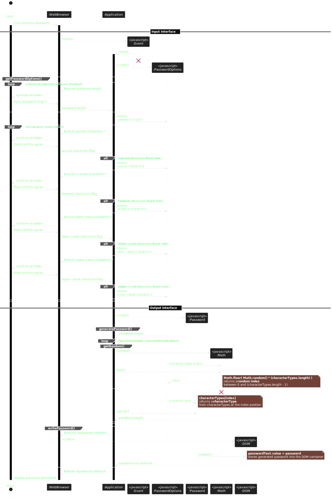

# Password Generator App

Intermediate JavaScript: Password Generator

## Table of contents

- [Password Generator App](#password-generator-app)
  - [Table of contents](#table-of-contents)
  - [Overview](#overview)
    - [The challenge](#the-challenge)
    - [Screenshot](#screenshot)
    - [Links](#links)
  - [My process](#my-process)
    - [Data Flow Analysis](#data-flow-analysis)
    - [Activity Diagram](#activity-diagram)
    - [Pseudocode](#pseudocode)
      - [Main workflow](#main-workflow)
      - [Refinement: 2. Confirm and validate "password length"](#refinement-2-confirm-and-validate-password-length)
      - [Refinement: 4. Confirm and validate "password character types"](#refinement-4-confirm-and-validate-password-character-types)
      - [Refinement: 6. Generate "password generated"](#refinement-6-generate-password-generated)
    - [Sequence Diagram](#sequence-diagram)
    - [Built with](#built-with)
    - [What I learned](#what-i-learned)
      - [Generate random strings](#generate-random-strings)
      - [StartUML - Activity Diagram](#startuml---activity-diagram)
      - [StartUML -  Sequence Diagram](#startuml----sequence-diagram)
    - [Continued development](#continued-development)
    - [Useful resources](#useful-resources)
  - [Author](#author)
  - [Acknowledgments](#acknowledgments)

## Overview

This week’s Challenge requires you to create an application that an employee can use to generate a random password based on criteria they’ve selected.

### The challenge

This week’s challenge requires you to create an application that an employee can use to generate a random password based on criteria they’ve selected by modifying starter code. This app will run in the browser, and will feature dynamically updated HTML and CSS powered by JavaScript code that you write. It will have a clean and polished user interface that is responsive, ensuring that it adapts to multiple screen sizes.

The password can include special characters. If you’re unfamiliar with these, see this [list of Password Special Characters from the OWASP Foundation](https://www.owasp.org/index.php/Password_special_characters).

### Screenshot


### Links

- Solution URL: [https://github.com/technoveltyco/bootcamp-week5-challenge](https://github.com/technoveltyco/bootcamp-week5-challenge)
- Live Site URL: [https://technoveltyco.github.io/bootcamp-week5-challenge/](https://technoveltyco.github.io/bootcamp-week5-challenge/)

## My process

First, I went through a design phase of the data flow, pseudocode, and modelling the activity and sequence diagrams of the application in UML.

You can check further details about the application design at the [software design document](./docs/software-design.md).

### Data Flow Analysis

| Inputs | Processes | Outputs |
| ----------- | ----------- | ----------- |
| Length | Validate length between 10 and 64 characters | Password generated matching the chosen criteria
| Character types | Validate at least one charater type is selected |

### Activity Diagram


### Pseudocode

#### Main workflow

```
Precondition. Receive a "Generate Password" event

1. Set "password length" to zero (0)

2. Confirm and validate "password length" user input

3. Initialise "password character types" as empty

4. Confirm and validate "password character types" user input

5. Initialise "password generated" as empty                         

6. Generate "password generated" with lenght and character types user's inputs

7. Output "password generated" 
```

#### Refinement: 2. Confirm and validate "password length"

```
2. While "password length" is not between 10 and 64 characters

  2.1 Get "password length" user's input

2. End While "password length"
```

#### Refinement: 4. Confirm and validate "password character types"

```
4. While "password characters" is empty

  4.1 Get "special characters" user's confirmation
  4.2 If user wants to include "special characters"
    4.2.1 Include "special characters" into "password characters"
  4.2 End If "special characters"

  4.3 Get "numeric characters" user's confirmation
  4.4 If user wants to include "numeric characters"
    4.4.1 Include "special characters" into "password characters"
  4.4 End If "numeric characters"

  4.5 Get "lower cased characters" user's confirmation
  4.6 If user wants to include "lower cased characters"
    4.6.1 Include "lower cased characters" into "password characters"
  4.6 End If "lower cased characters"

  4.7 Get "upper cased characters" user's confirmation
  4.8 If user wants to include "upper cased characters"
    4.8.1 Include "upper cased characters" into "password characters"
  4.8 End If "upper cased characters"

4. End While "password characters"
```
#### Refinement: 6. Generate "password generated"

```
6. While the length of "password generated" is not equal to "password length"

  6.1 Generate a random "index" between 0 and "password length" - 1

  6.2 Gets "character" in "password character types" at "index"

  6.3 Concatenate "character" into "password generatd"

6. End While "password generated"
```
### Sequence Diagram




### Built with

- [UML 2.5.1](https://www.omg.org/spec/UML)
- HTML5 markup
- CSS custom properties
- Vanilla JavaScript

### What I learned

#### Generate random strings

- Use math concepts to generate random strings.

```js
/**
 * Function for getting a random element from an array.
 * 
 * @param {Array} arr 
 *    The array of character types.
 * @returns {String}
 *    A randomly character type from arr.
 */
function getRandom(arr) {
  const randomIndex = Math.floor(Math.random() * arr.length);
  return arr[randomIndex];
}
```

- Learnt PlantUML to generate activity and sequence diagrams in UML.

#### StartUML - Activity Diagram

```uml
@startuml
start

:Click on **Generate Password**>

partition "Input Interface" {

  repeat :Wait ""password length"" input ?

    :Save ""password length""|

  repeat while (Is ""password length"" 10 to 64 characters ?) is (No)
  ->Yes;

  :Set ""password characters"" empty;

  while (Check ""password characters"" ?) is (Empty)

    if (Include ""special characters"" ?) then (Yes)
      :Add ""special characters"" into ""password characters"";
    else (No)
    endif

    if (Include ""numeric characters"" ?) then (Yes)
      :Add ""numeric characters"" into ""password characters"";
    else (No)
    endif

    if (Include ""lower cased characters"" ?) then (Yes)
      :Add ""lower cased characters"" into ""password characters"";
    else (No)
    endif

    if (Include ""upper cased characters"" ?) then (Yes)
      :Add ""upper cased characters"" into ""password characters"";
    else (No)
    endif

    :Save ""password characters""|

  endwhile (Not Empty)

}

partition "Output Interface" {

  :Set ""password"" empty|

  while (Check length of ""password"" ?) is (Not **password length**)

    :Next random ""index"";

    :Get ""character"" from ""password characters"" at ""index"";

    :Concatenate ""character"" into ""password"";

    :Save ""password""|

  endwhile (Is **password length**)

}

:Output **password**<

stop
@enduml
```

#### StartUML -  Sequence Diagram

```uml
@startuml
actor User
participant ":WebBrowser"
participant ":Application"

User->":WebBrowser": Click Generate Password
activate User
activate ":WebBrowser"

== Input Interface ==

":WebBrowser"-->"<< javascript >>\n:Event" **: << event >>
":Application"<-"<< javascript >>\n:Event": << bind >>
activate ":Application"
destroy "<< javascript >>\n:Event"

":Application"-->"<< javascript >>\n:PasswordOptions" **: << create >>

group getPasswordOptions()
  loop password length not between 10 and 64
    ":WebBrowser"<--":Application": Request password length 
    User<--":WebBrowser": << prompt window >>
    User->":WebBrowser": Input password length
    ":WebBrowser"->":Application": password length
  end

  ":Application"->"<< javascript >>\n:PasswordOptions": << store >> \n password length

  loop no character types chosen

    ":WebBrowser"<--":Application": Include special characters ?
    User<--":WebBrowser": << confirm window >>
    User->":WebBrowser": Press confirm option
    ":WebBrowser"->":Application": special characters flag

    alt special characters flag is True
      ":Application"->"<< javascript >>\n:PasswordOptions": << store >> \n special characters
    end

    ":WebBrowser"<--":Application": Include numeric characters ?
    User<--":WebBrowser": << confirm window >>
    User->":WebBrowser": Press confirm option
    ":WebBrowser"->":Application": numeric characters flag

    alt numeric characters flag is True
      ":Application"->"<< javascript >>\n:PasswordOptions": << store >> \n numeric characters
    end

    ":WebBrowser"<--":Application": Include lower cased characters ?
    User<--":WebBrowser": << confirm window >>
    User->":WebBrowser": Press confirm option
    ":WebBrowser"->":Application": lower cased characters flag

    alt lower cased characters flag is True
      ":Application"->"<< javascript >>\n:PasswordOptions": << store >> \n lower cased characters
    end

    ":WebBrowser"<--":Application": Include upper cased characters ?
    User<--":WebBrowser": << confirm window >>
    User->":WebBrowser": Press confirm option
    ":WebBrowser"->":Application": upper cased characters flag

    alt upper cased characters flag is True
      ":Application"->"<< javascript >>\n:PasswordOptions": << store >> \n upper cased characters
    end

  end
end

== Output Interface ==

":Application"-->"<< javascript >>\n:Password" **: << create >>

group generatePassword()

  ":Application"<--"<< javascript >>\n:PasswordOptions": passwordLength

  loop password.length < passwordLength times

    group getRandom()

      ":Application"->"<< javascript >>\n:Math" **: random()
      "<< javascript >>\n:PasswordOptions"->"<< javascript >>\n:Math": characterTypes.length
      ":Application"->"<< javascript >>\n:Math": floor()

      "<< javascript >>\n:PasswordOptions"<--"<< javascript >>\n:Math": index
      note right
        **Math.floor( Math.random() * (characterTypes.length) )**
        returns a **random index** 
        between 0 and (characterTypes.length - 1)
      end note
    end

    destroy "<< javascript >>\n:Math"

    "<< javascript >>\n:Password"<--"<< javascript >>\n:PasswordOptions": characterType
    note right
      **characterTypes[index]**
      returns a **characterType** 
      from characterTypes at the index position
    end note

    ":Application"->"<< javascript >>\n:Password": concat()
    ":Application"<--"<< javascript >>\n:Password": password.length

  end
end

group writePassword()

  ":WebBrowser"<-":Application": Request #password element
  ":WebBrowser"-->"<< javascript >>\n:DOM" **: << create >>

  "<< javascript >>\n:Password"->"<< javascript >>\n:DOM": password
  note right
    **passwordText.value = password**
    stores generated password into the DOM container
  end note

  ":Application"<--"<< javascript >>\n:DOM": passwordText element
end

":WebBrowser"<--":Application": Refresh #password element

User<--":WebBrowser": Display password generated

deactivate ":Application"
deactivate ":WebBrowser"
deactivate User
@enduml

```

### Continued development

- Implement UX improvements to integrate the password option in the UI, so the user can set the password length and character types on the web page.

- Improve the test coverage of the code implementing unit and functional tests.

### Useful resources

- [PlantUML](https://plantuml.com/) - A simple tool to design and modelling using UML language.
- [The Unified Modeling Language](https://www.uml-diagrams.org/) - Quick reference of the UML diagrams, with detailed syntax explanation and examples.
- [W3Schools JavaScript Tutorial](https://www.w3schools.com/js/default.asp) - A convenient reference for JavaScript, Web APIs and several code snippet examples.
- [MDN JavaScript Reference](https://developer.mozilla.org/en-US/docs/Web/javascript) - The main reference for JavaScript and Web APIs.

## Author
  Daniel Rodriguez
- GitHub - [Technoveltyco](https://github.com/technoveltyco)

## Acknowledgments

The teacher and TAs that help us with resources and support to my questions during the development of this challenge.
