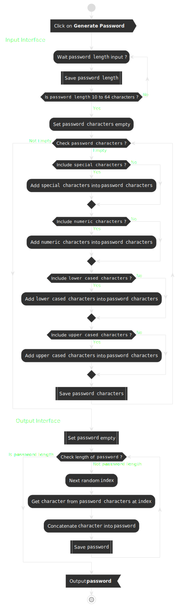

# Software Design: Password Generator

## Table of Contents

- [Software Design: Password Generator](#software-design-password-generator)
  - [Table of Contents](#table-of-contents)
  - [Functional Requirements](#functional-requirements)
  - [Data Flow Analysis](#data-flow-analysis)
  - [Activity Diagram](#activity-diagram)
  - [Pseudocode](#pseudocode)
    - [Main workflow](#main-workflow)
    - [Refinement: 2. Confirm and validate "password length"](#refinement-2-confirm-and-validate-password-length)
    - [Refinement: 4. Confirm and validate "password character types"](#refinement-4-confirm-and-validate-password-character-types)
    - [Refinement: 6. Generate "password generated"](#refinement-6-generate-password-generated)
  - [Sequence Diagram](#sequence-diagram)

## Functional Requirements

* Generate a password when the button is clicked.
* Length of password between 10 and 64 characters.
* Characters types are alphanumeric and special characters defined in [list of Password Special Characters from the OWASP Foundation](https://www.owasp.org/index.php/Password_special_characters).
* The user will have options to choose the lenght and types of characters of the password.
* The program should validate that the password lenght matches the number of characters constraint, and also require that the user specificy at least one character type.

## Data Flow Analysis

| Inputs | Processes | Outputs |
| ----------- | ----------- | ----------- |
| Length | Validate length between 10 and 64 characters | Password generated matching the chosen criteria
| Character types | Validate at least one charater type is selected |

## Activity Diagram



## Pseudocode

### Main workflow

```
Precondition. Receive a "Generate Password" event

1. Set "password length" to zero (0)

2. Confirm and validate "password length" user input

3. Initialise "password character types" as empty

4. Confirm and validate "password character types" user input

5. Initialise "password generated" as empty                         

6. Generate "password generated" with lenght and character types user's inputs

7. Output "password generated" 
```

### Refinement: 2. Confirm and validate "password length"

```
2. While "password length" is not between 10 and 64 characters

  2.1 Get "password length" user's input

2. End While "password length"
```

### Refinement: 4. Confirm and validate "password character types"

```
4. While "password characters" is empty

  4.1 Get "special characters" user's confirmation
  4.2 If user wants to include "special characters"
    4.2.1 Include "special characters" into "password characters"
  4.2 End If "special characters"

  4.3 Get "numeric characters" user's confirmation
  4.4 If user wants to include "numeric characters"
    4.4.1 Include "special characters" into "password characters"
  4.4 End If "numeric characters"

  4.5 Get "lower cased characters" user's confirmation
  4.6 If user wants to include "lower cased characters"
    4.6.1 Include "lower cased characters" into "password characters"
  4.6 End If "lower cased characters"

  4.7 Get "upper cased characters" user's confirmation
  4.8 If user wants to include "upper cased characters"
    4.8.1 Include "upper cased characters" into "password characters"
  4.8 End If "upper cased characters"

4. End While "password characters"
```
### Refinement: 6. Generate "password generated"

```
6. While the length of "password generated" is not equal to "password length"

  6.1 Generate a random "index" between 0 and "password length" - 1

  6.2 Gets "character" in "password character types" at "index"

  6.3 Concatenate "character" into "password generatd"

6. End While "password generated"
```
## Sequence Diagram

